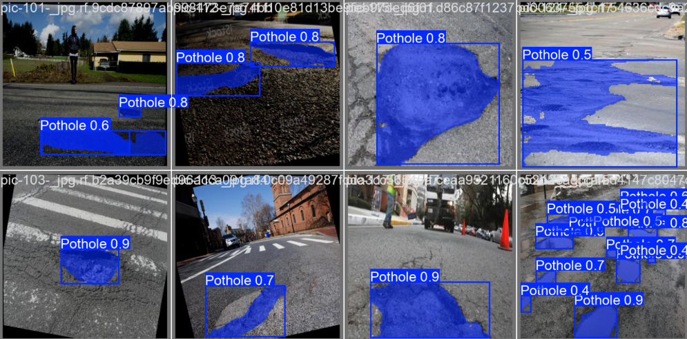

# 🎯 Pothole Segmentation using YOLOv11

## 📋 Project Overview

This project focuses on automatic detection and segmentation of potholes on streets using YOLOv11-seg, a state-of-the-art instance segmentation model. The system works with both images and videos, providing visual outputs that accurately identify pothole locations. This solution can assist municipalities and road maintenance teams in monitoring and managing road conditions efficiently.
  


## 📊 Dataset

- Sourced from Roboflow, specifically a potholes detection & segmentation dataset.
- Includes annotated images with segmentation masks for potholes.
- Prepared in YOLOv11 format for seamless model training.

## ✨ Key Features
- Instance segmentation of potholes (pixel-wise detection, not just bounding boxes).
- Works for single images, batch images, and video streams.
- Visualizations of precision-recall curves, confusion matrices, and validation predictions.
- Easy-to-use trained model for inference on new images and videos.

## 🛠️ Tech Stack

- **Programming Language:** Python
- **Libraries:**
   - Ultralytics YOLOv11 (for segmentation)
   - OpenCV (image & video processing)
   - Matplotlib (visualizations)
   - Roboflow (dataset management)
   - ffmpeg (video compression & display in notebooks)
   - Google Colab (GPU acceleration)

## 📁 Repository Structure

```
pothole_segmentation_yolov11/
│
├── Pothole_segmentation_with_YOLOv11.ipynb   # Main Jupyter Notebook with full code
├── README.md                                  # This file
└── screenshots/                               # Example output images
    ├── image.png
    └── video.mp4
                                    # This file

```
## 📈 Results and Performance

- Trained YOLOv11 segmentation model achieved high accuracy in detecting and segmenting potholes.
- Generated precision-recall curves, confusion matrices, and validation predictions for model evaluation.
- Predictions on test images and videos show robust segmentation under various road conditions.
   ```
## 🌐 Applications

- Integration with autonomous vehicles or smart city applications for real-time pothole detection.
- Road monitoring and maintenance automation.
- Urban infrastructure analysis and reporting.

## 🔮 Future Improvements

- Expand dataset for different road conditions and lighting scenarios.
- Optimize model for real-time inference on edge devices.
- Implement automated alert systems for detected potholes.


## 👩‍💻 Author

**Eya Zaoui**
- 💼 AI & Software Engineer | Passionate about Machine Learning, Expert Systems, and Optimization Algorithms
- 📧 Email: zaouieya2@gmail.com
- 🔗 LinkedIn: [linkedin.com/in/eya-zaoui](linkedin.com/in/eya-zaoui)
